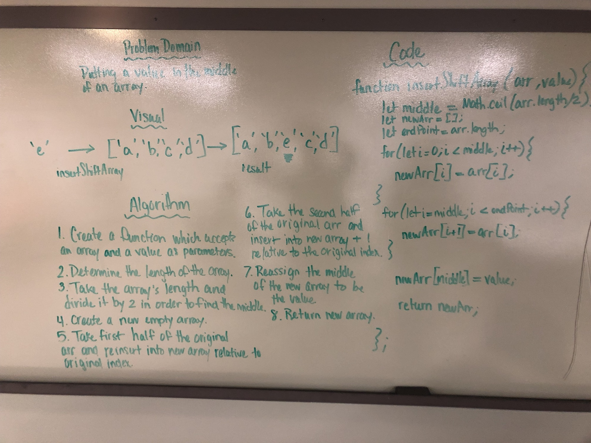
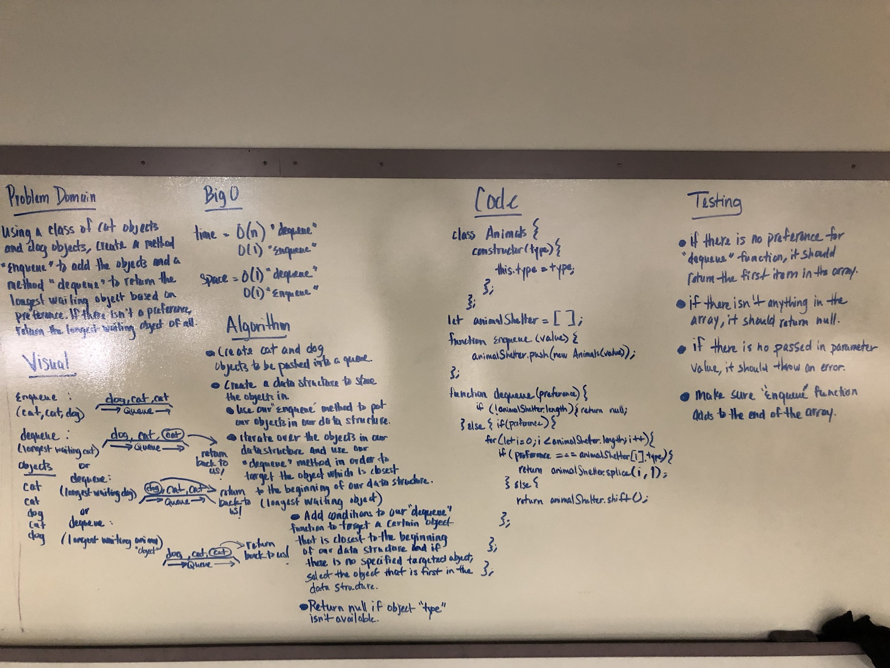
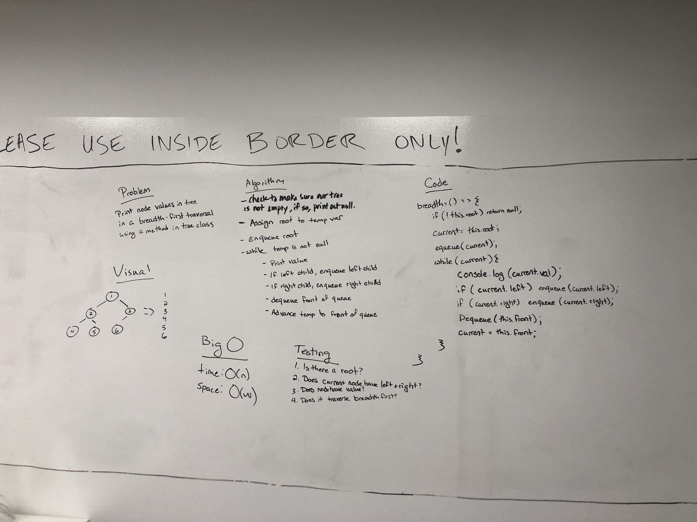

# Reverse an Array
The elements of an array will be in an order. The elements will need to be arranged in a reversed order.

## Challenge
Write a function called reverseArray which takes an array as an argument. Without utilizing any of the built-in methods available to your language, return an array with elements in reversed order.

## Solution

# Insert Shift an Array
The value passed in as a parameter will be placed in the center of the array that is passed into the parameter.

## Challenge
Write a function called insertShiftArray which takes in an array and the value to be added. Without utilizing any of the built-in methods available to your language, return an array with the new value added at the middle index.

## Solution

# Binary Search
The array passed in to the function's first parameter will be searched through to find the value passed in as the second parameter.

## Challenge
Write a function called BinarySearch which takes in 2 parameters: a sorted array and the search key. Without utilizing any of the built-in methods available to your language, return the index of the array’s element that is equal to the search key, or -1 if the element does not exist.

## Solution

# Linked List Iterations
Create a Node class that has properties for the value stored in the Node, and a pointer to the next Node. Add three methods.

## Challenge

The linked list constructor should have methods which will append `.append(value)` a new node to the end of the list, insert a new node before another node `.insertBefore(value, newNodeValue)`, and insert a new node after another node `.insertAfter(value, newNodeValue)`.

## Solution

# Stacks and Queues

## Challenge

## Solution

# Queue With Stacks

## Solution

# FIFO Animal Shelter
Demonstrating the concept of queues and using the enqueue and dequeue methods.

## Challenge
Create a class called `AnimalShelter` which holds only dogs and cats. The shelter operates using a first-in, first-out approach. Implement the following methods:
`enqueue(animal)`: adds animal to the shelter. animal can be either a dog or a cat object.
`dequeue(pref)`: returns either a dog or a cat. If pref, a string, is ‘cat’ return the longest-waiting cat. If pref is ‘dog’, return the longest-waiting dog. For anything else, return either a cat or a dog.

## Solution

# Linked List Merge
A linked list that is a merged version of two linked lists.

## Challenge
Write a function called `mergeLists` which takes two linked lists as arguments. Zip the two linked lists together into one so that the nodes alternate between the two lists and return a reference to the head of the zipped list. Try and keep additional space down to O(1). You have access to the Node class and all the properties on the Linked List class as well as the methods created in previous challenges.

## Solution

# Multi-bracket Validation
A validator for brackets and their matching closing brackets.

## Challenge
Create a function that takes a string as its only argument, and return a boolean representing whether or not the brackets - `{}`, `[]`, `()` - in the string are balanced.

## Solution

# FizzBuzz Tree
Conduct “FizzBuzz” on a tree while traversing through it. Change the values of each of the nodes dependent on the current node’s value

## Challenge
Write a function called FizzBuzzTree which takes a tree as an argument. Without utilizing any of the built-in methods available to your language, determine weather or not the value of each node is divisible by 3, 5 or both, and change the value of each of the nodes respectively. Return the tree with it’s news values.

## Solution

# Breadth-first Traversal
Search a tree by starting at the tree's root, and explore all of the neighbor nodes at the present depth prior to moving on to the nodes at the next depth level.

## Challenge
Write a breadth first traversal method which takes a Binary Tree as its unique input. Without utilizing any of the built-in methods available to your language, traverse the input tree using a Breadth-first approach; print every visited node’s value.

## Solution

# Left Join
Implement a simplified LEFT JOIN for 2 Hashmaps. (Katherine & I were partners)

## Challenge
Write a function that LEFT JOINs two hashmaps into a single data structure. The first parameter is a hashmap that has word strings as keys, and a synonym of the key as values. The second parameter is a hashmap that has word strings as keys, and antonyms of the key as values. Combine the key and corresponding values (if they exist) into a new data structure according to LEFT JOIN logic. LEFT JOIN means all the values in the first hashmap are returned, and if values exist in the “right” hashmap, they are appended to the result row. If no values exist in the right hashmap, then some flavor of `NULL` should be appended to the result row.

The returned data structure that holds the results is up to you. It doesn’t need to exactly match the output below, so long as it achieves the LEFT JOIN logic.

## Solution
