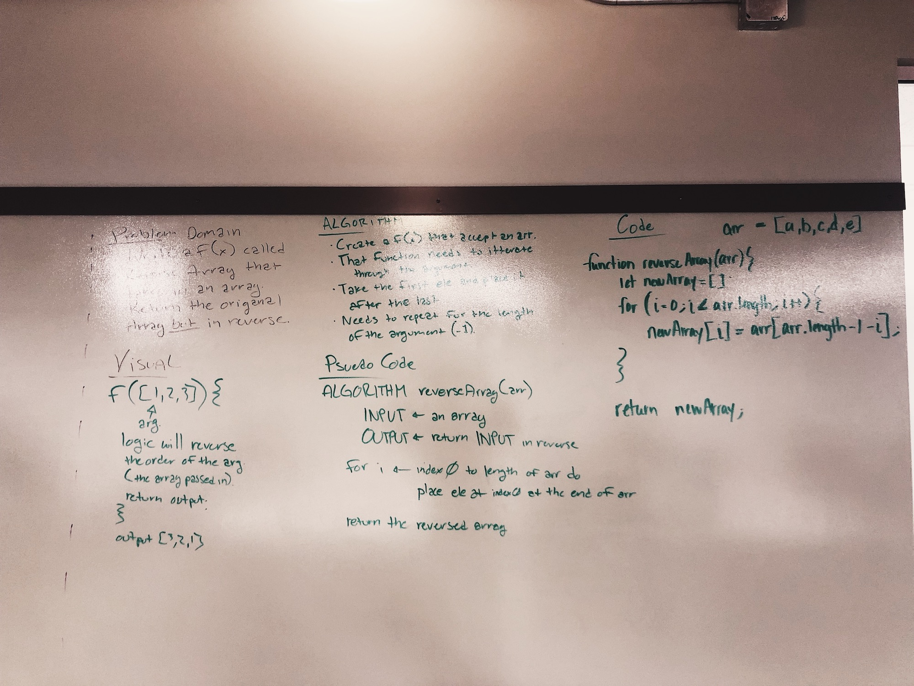

// DAY 01
# Reverse an Array
The elements of an array will be in an order. The elements will need to be arranged in a reversed order.

## Challenge
Write a function called reverseArray which takes an array as an argument. Without utilizing any of the built-in methods available to your language, return an array with elements in reversed order.

## Solution

// DAY 02
# Insert Shift an Array
The value passed in as a parameter will be placed in the center of the array that is passed into the parameter.

## Challenge
Write a function called insertShiftArray which takes in an array and the value to be added. Without utilizing any of the built-in methods available to your language, return an array with the new value added at the middle index.

## Solution

// DAY 03
# Binary Search
The array passed in to the function's first parameter will be searched through to find the value passed in as the second parameter.

## Challenge
Write a function called BinarySearch which takes in 2 parameters: a sorted array and the search key. Without utilizing any of the built-in methods available to your language, return the index of the array’s element that is equal to the search key, or -1 if the element does not exist.

## Solution

// Day 05
# Linked List Iterations
Create a Node class that has properties for the value stored in the Node, and a pointer to the next Node. Add three methods.

## Challenge

The linked list constructor should have methods which will append `.append(value)` a new node to the end of the list, insert a new node before another node `.insertBefore(value, newNodeValue)`, and insert a new node after another node `.insertAfter(value, newNodeValue)`.

## Solution

// Day 06
#

## 

##

// Day 07
# Linked List Merge
Create a new linked list that is a merged version of two linked lists.

## Challenge
Write a function called `mergeLists` which takes two linked lists as arguments. Zip the two linked lists together into one so that the nodes alternate between the two lists and return a reference to the head of the zipped list. Try and keep additional space down to O(1). You have access to the Node class and all the properties on the Linked List class as well as the methods created in previous challenges.

## Solution

